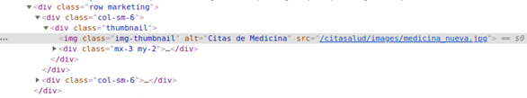

# Usabilidad y Accesibilidad 

##### INTEGRANTES

+ Eduardo Pérez Suárez, [alu0100890174@ull.edu.es](alu0100890174@ull.edu.es)

+ David Lázaro Febles, [alu0100770032@ull.edu.es](alu0100770032@ull.edu.es)

+ Maria Elena Salazar Álvarez, [alu0100965902@ull.edu.es](alu0100965902@ull.edu.es)

+ Ainoa Iglesias Dasilva, [alu0101164403@ull.edu.es](alu0101164403@ull.edu.es)

## Práctica 1 

### Uso del navegador para el desarrollo web

#### 1. ¿Qué peticiones desencadena la consulta?
-Peticiones de html:

-Peticiones de css:

-Peticiones de imágenes:

-Peticiones de js:

#### 2. ¿Qué tipo de petición estás realizando?

#### 3. ¿Qué código de estatus devuelve?

#### 4. ¿Qué DNS tiene el servidor?

#### 5. ¿Qué IP tiene tiene el servidor?

#### 6. ¿La página tiene alguna cookie?, ¿Cuáles?

#### 7. ¿Qué idioma acepta?

#### 8. Alguna línea de código JavaScript.

#### 9. Alguna línea de código CSS que se aplique.

#### 10. Alguna línea de código HTML que se aplique

